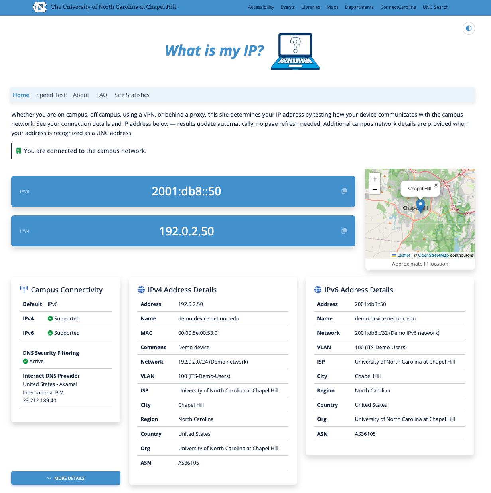

# What Is My IP?

A Flask web application that tells users their IP address and provides detailed network diagnostics — especially useful for campus networks where users need to know whether they appear on-campus, what VLAN they're on, or whether a VPN is active.

Built and operated by [UNC Information Technology Services](https://its.unc.edu/). Designed to be adapted for other higher-education institutions.

> **Note:** This GitHub repository is a read-only mirror. The canonical repository is hosted on UNC's internal GitLab instance, which is not reachable from the public internet. Please open issues here on GitHub and we will review them.



---

## What it does

**For all visitors:**

- IPv4 and IPv6 address detection (via separate dual-stack endpoints)
- ISP name and geolocation
- Internet DNS provider identification
- DNS security filtering status (tests whether your DNS provider blocks malicious domains)

**For campus devices (addresses matching configured CIDR blocks):**

- VLAN name and ID
- DHCP server, router, and lease details from Infoblox IPAM
- NAC endpoint details from Extreme Networks XMC (switch port, policy, connection type)
- Building name and map location for wired and wireless connections (via building lookup API)

**Metrics dashboard** (`/metrics`): aggregate usage statistics — IP version breakdown, campus vs. off-campus ratio, ISP distribution, country distribution, and daily visit trends.

---

## Architecture

```text
Browser
  │
  ├── GET /          → home page (Flask/Jinja2 template)
  └── GET /hostinfo  → JSON API (IP details, geolocation, IPAM, NAC)
           │
           ├── ip-api.com / iplocation.net   — geolocation (public API)
           ├── Infoblox IPAM                 — network/VLAN/DHCP details (campus only)
           ├── Extreme Networks XMC          — NAC endpoint details (campus only)
           └── Building API (NIT)            — building name & location (wired switch or wireless AP)
```

The front-end fetches `/hostinfo` twice — once over IPv4 and once over IPv6 — to determine which address family is active. All JS/CSS dependencies (Bootstrap/MDB, Font Awesome, jQuery) are served locally with no external CDN calls at runtime.

---

## Detection flow

The application uses a Flask blueprint structure. `whatismyip/__init__.py` contains the `create_app()` factory; routes are split across `whatismyip/routes/` (`main.py` for the home page, `api.py` for `/hostinfo` and `/dns-result`, `pages.py` for static pages and error handlers, `metrics.py` for the dashboard). External API calls live in `whatismyip/utils.py`, metrics storage in `whatismyip/db.py`, and site config loading in `whatismyip/site_config.py`.

### Step 1 — Client IP (from HTTP)

The visitor's IP is read from the HTTP connection at request time (`X-Forwarded-For` is respected when behind a proxy). This is the only thing known at the start of a request.

### Step 2 — Infoblox IPAM (queried by IP)

`get_address_objects(ip)` hits the Infoblox WAPI (`ipv4address` or `ipv6address` endpoint, depending on IP version). Returns whatever IPAM knows about that address:

- DNS hostnames, record types, and usage flags
- DHCP lease state
- Extended attributes: Admin Onyen, Administrator name, Admin Email, Department
- **MAC address** — only present when IPAM has an active DHCP lease for this IP; absent for static IPs, expired leases, and most IPv6 addresses

The MAC from IPAM is passed into Step 3 as the preferred lookup key.

### Step 3 — NAC / Extreme XMC (MAC-first, IP fallback)

`get_nac_info(ip, mac)` runs up to three XMC NBI calls, stopping early when data is found:

1. **By MAC** — `getEndSystemByMac(mac)`: attempted first if IPAM provided a MAC address in Step 2. NAC operates primarily on MAC addresses; IP-to-session mappings are populated by supplemental data feeds and may lag behind the current session.
2. **By IP fallback** — `getEndSystemByIp(ip)`: attempted if no MAC was available from IPAM, or if the MAC lookup returned nothing. Covers cases where IPAM has no active DHCP lease for the address.
3. **Device profile** — `getMacAddress(mac)`: once any MAC is known (from either NAC result above, or directly from the IPAM fallback), fetches the device's persistent profile — vendor, device type, registration info, etc.

**Important constraints:**

- NAC is only queried for campus IPv4 addresses. IPv6 campus clients skip NAC entirely.
- If both the IP lookup and the IPAM MAC path miss, no NAC data is returned and the NAC and device cards are hidden.

### Step 4 — Building lookup via NIT (by switch IP or AP building ID)

After NAC returns, `switchPortId` is inspected with a regex to determine connection type:

- **Wired** — `switchPortId` is a plain port string (e.g. `GigabitEthernet1/0/24`): calls `get_nit_building(switchIP)` which looks up the building by the switch's IP address.
- **Wireless** — `switchPortId` matches the AP pattern `<name> (<mac>):<ssid>`: the AP name is parsed for a building ID prefix (e.g. `EP-0162-...` → building `0162`), then `get_nit_building_by_id(bldg_id)` is called directly.

Both NIT calls return a building record with `official_name`, `full_name`, `address`, `building_id`, `latitude`, and `longitude`.

### Where each field comes from

| Field | Source | Notes |
| --- | --- | --- |
| IP address | HTTP connection | Always present |
| IP version, private/global flags | Python `ipaddress` stdlib | Always computed |
| ISP, geolocation, ASN | ip-api.com | Public IPs only |
| DNS hostnames, record types | Infoblox IPAM | Campus only |
| DHCP lease state, server, router | Infoblox IPAM | Campus only; DHCP leases only |
| MAC address | Infoblox IPAM (DHCP lease) | May be absent |
| Admin contact info | Infoblox extattrs | Campus only |
| Switch port / AP / policy | Extreme XMC (by IP, then MAC) | Campus IPv4 only |
| Device vendor / type profile | Extreme XMC `getMacAddress` | Requires a MAC from Step 2 or 3 |
| Building name, address, map | NIT building API | Derived from switch IP or AP name |

---

## Prerequisites

- Python 3.11+ (or 3.10 with `tomli` installed — handled automatically by `requirements.txt`)
- pip / virtualenv

### DNS configuration for dual-stack detection

The dual-stack IPv4/IPv6 detection relies on separate hostnames with deliberately restricted DNS records. The browser's Happy Eyeballs algorithm will choose IPv6 when both record types are present, so the per-protocol hostnames must advertise only one record type each:

| Hostname                       | DNS records required  | Purpose                                           |
| ------------------------------ | --------------------- | ------------------------------------------------- |
| `whatismyip.example.edu`       | A **and** AAAA        | Primary site URL — reachable over both protocols  |
| `ipv4.whatismyip.example.edu`  | A only (no AAAA)      | Forces IPv4 — browsers cannot fall back to IPv6   |
| `ipv6.whatismyip.example.edu`  | AAAA only (no A)      | Forces IPv6 — browsers cannot fall back to IPv4   |

Set these three hostnames in `FLASK_SERVER_URL`, `FLASK_IPV4_SERVER_URL`, and `FLASK_IPV6_SERVER_URL` respectively. If your institution does not have IPv6 on campus, leave `FLASK_IPV6_SERVER_URL` empty and the dual-stack check is skipped automatically.

**Optional external integrations** (the app runs without them; campus-specific sections are simply omitted):

| Integration           | Purpose                                             | Required?  |
| --------------------- | --------------------------------------------------- | ---------- |
| Infoblox IPAM         | Network, VLAN, and DHCP details for campus IPs      | Optional   |
| Extreme Networks XMC  | NAC endpoint details (switch port, policy)          | Optional   |
| Building API (NIT)    | Building name and map (wired switch or wireless AP) | Optional   |
| Google Maps API       | Embedded map (when `[map] provider = "google"`)     | Optional   |
| Speedtest Custom      | Branded speed test iframe                           | Optional   |

---

## Quick start (local development)

```bash
git clone <repo-url>
cd whatismyip

python -m venv env
source env/bin/activate          # Windows: env\Scripts\activate
pip install -r requirements.txt

cp .env.example .env             # edit .env with your values
cp data/config.toml.example data/config.toml   # edit with your campus CIDR blocks

flask --app whatismyip run
```

Open <http://127.0.0.1:5000>.

### Debugging a specific IP address locally

Set `CLIENT_ADDRESS` in your `.env` (no `FLASK_` prefix) to override the detected address for every request. This is useful for testing campus-specific lookups without being on the campus network:

```bash
CLIENT_ADDRESS=152.2.1.2   # treated as the visitor's IP for all routes
```

Remove or unset the variable to go back to real address detection.

---

## Configuration

Configuration lives in two places:

### Environment variables (`.env` / OpenShift secrets)

Copy `.env.example` to `.env` and fill in values. See that file for descriptions of every variable.

Key variables:

| Variable                                             | Description                                         |
| ---------------------------------------------------- | --------------------------------------------------- |
| `FLASK_SECRET_KEY`                                   | Random secret for Flask sessions                    |
| `FLASK_SERVER_URL`                                   | Primary public URL                                  |
| `FLASK_IPV4_SERVER_URL`                              | IPv4-only hostname for dual-stack detection         |
| `FLASK_IPV6_SERVER_URL`                              | IPv6-only hostname for dual-stack detection         |
| `FLASK_IB_SERVER`                                    | Infoblox IPAM hostname                              |
| `FLASK_IB_USERNAME` / `FLASK_IB_PASSWORD`            | Infoblox API credentials                            |
| `FLASK_XMC_SERVER`                                   | Extreme Networks XMC hostname                       |
| `FLASK_XMC_CLIENT_ID` / `FLASK_XMC_SECRET`           | XMC OAuth credentials                               |
| `FLASK_NIT_SERVER` / `FLASK_NIT_AUTH`                | Building API hostname and auth token                |
| `FLASK_GOOGLE_MAPS_API_KEY`                          | Google Maps embed API key                           |
| `FLASK_METRICS_USERNAME` / `FLASK_METRICS_PASSWORD`  | Basic auth for `/metrics` (leave blank for public)  |

Flask picks up all `FLASK_`-prefixed variables automatically via `app.config.from_prefixed_env()`.

### `data/config.toml`

Runtime configuration that can be changed without redeploying code. On OpenShift this file lives on a PersistentVolumeClaim. The app writes a default copy from `data/config.toml.example` on first start if the file is missing.

```toml
[site]
name = "Your Institution Name"
city = "Your City"
country_code = "US"
country_name = "United States"
lat = 0.0
lon = 0.0

[dns]
# URL blocked by your DNS security filtering service (leave empty to disable the test)
security_filter_test_url = ""

[map]
# "leaflet" uses OpenStreetMap tiles — free, no API key required (default)
# "google"  uses the Google Maps JavaScript API — requires FLASK_GOOGLE_MAPS_API_KEY
provider = "leaflet"

[campus]
# CIDR blocks treated as campus addresses
networks = [
    "192.0.2.0/24",
    "10.0.0.0/8",
    "2001:db8::/32",
]
```

The `[site]` block provides the ISP name and geolocation used when a visitor's IP is a private or campus address that the public geolocation API cannot resolve.

Networks are parsed into `ipaddress.ip_network` objects at startup — changes require a restart.

### DNS security filtering test

The `[dns] security_filter_test_url` setting enables the **DNS Security Filtering** row in the connectivity card. Leave it empty to hide the row entirely.

**How it works:** The visitor's browser (not the server) performs a `fetch()` to the configured URL using `HEAD` and `no-cors` mode. Because the test runs client-side, it uses the visitor's actual DNS resolver — not the server's.

- If filtering is **active**: the DNS security service blocks the domain (either fails to resolve it or redirects to a block page the browser treats as a network error). The fetch throws a `TypeError` → displayed as **Active**.
- If filtering is **inactive**: the fetch reaches the server and returns without a network-level error, even if the response is CORS-rejected. → displayed as **Inactive**.
- A 5-second timeout or any other error → **Unable to verify**.

**Choosing a test URL:** Use a URL your DNS filtering vendor provides specifically for this purpose — a domain that is permanently listed as blocked by their service but is otherwise harmless. Most enterprise DNS filtering vendors (Akamai ETP, Cisco Umbrella, Zscaler, etc.) publish an official phishing or malware test URL for exactly this use. Do not use a real malicious domain; use the vendor's sanctioned test endpoint so the result is reliable and the domain stays consistently blocked.

The test URL **must use `https://`**. Browsers block mixed-content requests — JavaScript on an HTTPS page cannot make outbound HTTP fetch calls, so an `http://` test URL will always fail regardless of filtering status.

---

## Running in production

### Gunicorn

```bash
gunicorn --config gunicorn.conf.py wsgi:application
```

### OpenShift / Kubernetes

The app is designed for container deployment. Key points:

- Mount a PersistentVolumeClaim at `/data` — the app reads/writes `config.toml` and `metrics.sqlite3` there
- Inject credentials as environment variables from Secrets (see `.env.example` for the full list)
- The app self-bootstraps `data/config.toml` from `data/config.toml.example` on first start if the file is missing — populate the PVC after deployment to configure campus ranges
- Set `FLASK_SERVER_URL`, `FLASK_IPV4_SERVER_URL`, and `FLASK_IPV6_SERVER_URL` to your actual hostnames

---

## Adapting for your institution

Most content that refers to UNC can be found in these locations. Search for `CUSTOMIZE:` comments in the templates to find the exact lines.

### Templates (`whatismyip/templates/`)

| File          | What to change                                       |
| ------------- | ---------------------------------------------------- |
| `base.html`   | Institution meta tags, scripts, nav bar, and footer  |
| `home.html`   | Speedtest URL or card, JSON-LD organization info     |
| `faq.html`    | Q&A content and knowledge base links                 |
| `about.html`  | About text and IT department links                   |

### Static assets (`whatismyip/static/`)

| Path                                       | What to change                                      |
| ------------------------------------------ | --------------------------------------------------- |
| `logo/`                                    | Favicon set, web manifest, and app icons — replace  |
| `img/laptop-logo-transparent-cropped.png`  | Header logo — replace with your own                 |
| `img/UNCwebsite_textreatment_white.png`    | UNC wordmark in the footer — replace or remove      |

### Integrations

If your institution doesn't use Infoblox or Extreme XMC, the relevant sections in `utils.py` (`get_network`, `get_address_objects`, `get_nac_info`) can be removed or replaced with calls to your own IPAM/NAC systems. The app handles failures from all external calls gracefully — a missing integration simply omits that section from the output.

The building lookup (`get_nit_building`, `get_nit_building_by_id` in `utils.py`) uses a UNC-specific internal API. Replace these functions with your own building directory API or remove them if you don't need building-level detail.

---

## Running tests

```bash
pip install -r requirements.txt
pip install pytest pytest-cov

pytest tests/
pytest tests/ --cov=whatismyip --cov-report=term-missing   # with coverage
```

---

## License

MIT License — see [LICENSE.md](LICENSE.md).

Copyright (c) 2022 William Whitaker, UNC Information Technology Services.
